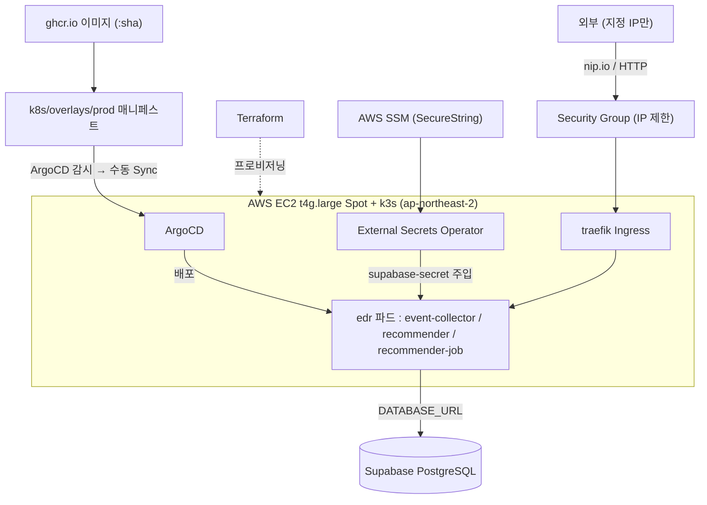

# event-driven-recommendation-infra

유저 행동 기반 추천 시스템 — **인프라 + 배포 레포** (Terraform · EC2 Spot · k3s · ArgoCD GitOps)

[event-driven-recommendation-app](https://github.com/Zuzzang2/event-driven-recommendation-app) 의 CI가 `ghcr.io`에 올린 이미지를 받아, **AWS EC2(k3s)** 위에 **ArgoCD GitOps**로 배포하는 레포입니다. (DevOps 중심 포트폴리오의 인프라 측)

## 아키텍처



### 인프라 토폴로지
```
┌──────────────────────────────────────────────────────────┐
│                AWS  ap-northeast-2 (서울)                  │
│  ┌──────────── VPC 10.0.0.0/16 ────────────────────────┐  │
│  │  Internet Gateway   /   Security Group (지정 IP만)    │  │
│  │  ┌── Public Subnet 10.0.1.0/24 (2a) ──────────────┐  │  │
│  │  │  EIP → EC2 t4g.large Spot (ARM 2vCPU / 8GB)     │  │  │
│  │  │  ┌──────────── k3s (단일 노드) ──────────────┐   │  │  │
│  │  │  │  traefik Ingress (:80/:443)               │   │  │  │
│  │  │  │  [argocd] ArgoCD   [external-secrets] ESO │   │  │  │
│  │  │  │  ┌────────── namespace: edr ──────────┐   │   │  │  │
│  │  │  │  │ event-collector / recommender      │   │   │  │  │
│  │  │  │  │ recommender-job (CronJob */5)      │   │   │  │  │
│  │  │  │  │ Secret: supabase-secret ← ESO      │   │   │  │  │
│  │  │  │  └────────────────────────────────────┘   │   │  │  │
│  │  │  └───────────────────────────────────────────┘   │  │  │
│  │  └─────────────────────────────────────────────────┘  │  │
│  └──────────────────────────────────────────────────────┘  │
│  AWS SSM Parameter Store (DATABASE_URL)                     │
└──────────────────────────────────────────────────────────┘
외부 연동: ghcr.io (이미지) · Supabase (PostgreSQL)
```

## 디렉토리 구조

```
terraform/
  versions.tf
  modules/
    aws-vpc/         # VPC, public subnet, IGW, route table
    aws-sg/          # Security Group (allowed_cidrs 로 IP 제한)
    aws-ec2/         # t4g.large Spot + EIP + IAM instance profile(SSM) + IMDSv2
    k3s-bootstrap/   # remote-exec k3s 설치 + kubeconfig fetch
  environments/dev/  # 모듈 호출 진입점 (여기서 terraform 실행)

k8s/
  base/<svc>/        # 서비스별 kustomization (deployment·service·configmap | cronjob)
  overlays/prod/<svc># 서비스별 오버레이 (ArgoCD Application 경로)

argocd/
  install/values.yaml  # ArgoCD helm 리소스 제한
  apps/                # Application 3개 (수동 sync)

external-secrets/    # SecretStore(aws-ssm) + ExternalSecret(supabase-secret ← SSM)
scripts/bootstrap.sh # 클러스터 전체 복구 1커맨드
```

## 사전 준비
- AWS CLI 자격증명 (`aws configure`, region `ap-northeast-2`)
- SSH 키 (`~/.ssh/id_ed25519`)
- `terraform`, `kubectl`, `helm`

## 실행

### ① 인프라 프로비저닝 (Terraform)
```bash
cd terraform/environments/dev
# terraform.tfvars 작성 (gitignore). 핵심:
#   allowed_cidrs = ["<내 공인 IP>/32"]   # SG 인바운드 제한
terraform init
terraform apply        # VPC + EC2 Spot + k3s + kubeconfig(~/.kube/k3s-config) 자동
```

### ② 클러스터 부트스트랩 (ArgoCD · ESO · 앱)
```bash
./scripts/bootstrap.sh
# bare k3s → ArgoCD(helm) → External Secrets Operator(helm)
#   → edr ns + ExternalSecret(SSM→supabase-secret) → Application 3개 → 초기 Sync
```
> `bootstrap.sh`는 idempotent하며, 클러스터가 내려가 있으면 terraform 재기동까지 포함합니다.

## 시크릿 (ESO + AWS SSM)
DATABASE_URL은 git이 아니라 **AWS SSM Parameter Store**에 보관하고, **External Secrets Operator**가 클러스터로 동기화합니다.
```bash
aws ssm put-parameter --region ap-northeast-2 \
  --name /edr/supabase/database_url --type SecureString \
  --value 'postgresql://...' --overwrite
```
EC2 인스턴스 역할(IAM instance profile + IMDSv2 hop limit 2)로 ESO가 SSM을 읽습니다. **Spot 회수로 클러스터가 초기화돼도 `bootstrap.sh`가 ESO를 통해 시크릿을 자동 복구** (수동 주입 0).

## 외부 노출
traefik Ingress(k3s 기본) + nip.io 호스트로 노출하고, **SG 인바운드를 `allowed_cidrs`(지정 IP)로 제한**합니다.
- `http://events.<EIP>.nip.io` (event-collector) / `http://predict.<EIP>.nip.io` (recommender)
- 현재 HTTP. 프로덕션 TLS는 실도메인 + cert-manager + Let's Encrypt로 별도 구성.

## 배포 (CD) — 수동 Sync
GitHub Actions CD 자동화 대신 **이미지 태그를 매니페스트에 `:sha`로 고정 + ArgoCD 수동 Sync** 방식.
```bash
# 새 버전: 매니페스트 image 태그를 새 :sha 로 수정·commit → ArgoCD에서 Sync
kubectl -n argocd port-forward svc/argocd-server 8080:443   # UI: https://localhost:8080 (admin/admin)
argocd app sync event-collector recommender recommender-job # 또는 UI Sync 버튼
```

## 운영 — Spot 회수 복구
EC2 Spot은 자주 회수됩니다(클러스터 상태 전체 소실). 복구는 **한 줄**:
```bash
./scripts/bootstrap.sh
```

## 기술 스택 / RAM 예산 (8GB)

| 영역 | 기술 | RAM(목표) |
|------|------|-----------|
| IaC | Terraform (모듈화) | — |
| 클러스터 | EC2 t4g.large Spot + k3s | ~500MB |
| GitOps | ArgoCD (helm, 수동 sync) | limits ~768Mi / 실사용 ~180Mi |
| 시크릿 | External Secrets Operator + AWS SSM | ~100Mi |
| 외부노출 | traefik Ingress + SG IP 제한 | (k3s 내장) |
| 모니터링 | Prometheus + Grafana | 예정 |

## 참고
- 앱 레포: [event-driven-recommendation-app](https://github.com/Zuzzang2/event-driven-recommendation-app)
- DB: Supabase (ap-southeast-2) / EC2: ap-northeast-2 (서울)
